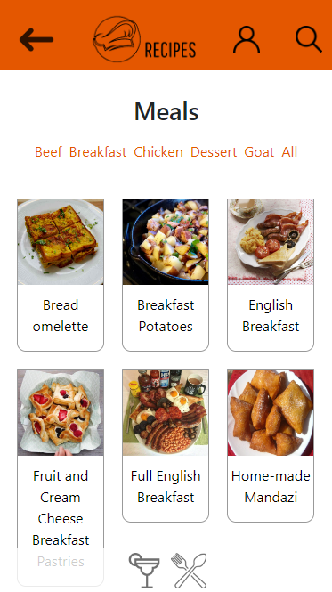
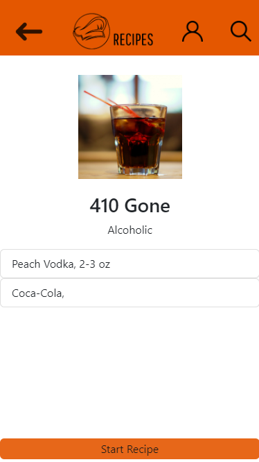

# Projeto App de Receitas! #

Este projeto, foi desenvolvido em grupo utilizando React Hooks e Context API. Nessa aplicação, o usuário será capaz de:

- Fazer login
- Pesquisar receitas de comidas 🍔
- Pesquisar receitas de bebidas 🍹
- Favoritar Receitas
- Acompanhar o progresso das receitas
- Verificar na página de perfil as receitas concluídas e em andamento.

Além disso, neste projeto, foi verificado nossa capacidade de:
- Utilizar a Context API do React para gerenciar estado
- Utilizar o React Hook useState
- Utilizar o React Hook useContext
- Utilizar o React Hook useEffect
- Criar Hooks customizados
- Usar a metodologia Kanban para divisão de tarefas

### ⚙️ Deploy da aplicação ###
Você pode ver o projeto funcionando aqui: https://toscano-recipes-app.vercel.app/.
Este projeto foi desenvolvido para ter um foco maior em design mobile.

 

 

### Utilizamos também Bootstrap para desenvolver o layout responsivo e agradável em toda a aplicação. ###

### Para qualquer dúvida, entre em contato comigo: ###
Em caso de dúvidas ou para entrar em contato, você pode me encontrar em:

- ✉️ Email: gabrieltoscano1@outlook.com
- 🔗 Linkedin: https://www.linkedin.com/in/gabrieltoscanoml/
